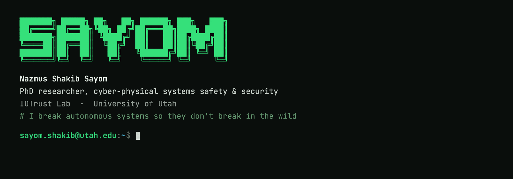

<picture>
  <source media="(prefers-reduced-motion: reduce)" srcset="assets/sayom-terminal.png">
  
</picture>

I’m a Computer Science PhD student at the [University of Utah](https://www.utah.edu/), in the [IOTrust Lab](https://iotrustlab.com/people/nsssayom/), advised by [Prof. Luis Garcia](https://lagarcia.us/). I study **cyber-physical systems safety and security**, with a focus on system verification and safety falsification for robotic and autonomous systems.

Before my PhD, I developed and maintained an embedded Linux OS at [meldCX](https://www.meldcx.com/). It hosted services that connected sensitive peripherals to kiosk applications across operating systems. My work included Yocto builds for enterprise ARM boards, C/C++ and Python services, security hardening, and reliable OTA updates at scale. I also taught Operating Systems and Embedded Systems.

**Selected work**

- **[Obadh](https://github.com/unmukto-org/obadh_engine)** · A shared Rust engine for Bangla typing, with correction and suggestion layers, a C ABI, and WebAssembly support. Released apps for [iPhone and iPad](https://github.com/unmukto-org/obadh-ios) and [Mac](https://github.com/unmukto-org/obadh-macos/releases/latest).
- **[Buggy Drone](https://github.com/iotrustlab/buggy_drone)** · A drone simulator and reduced execution pipeline for testing a known emergency-deployment flaw, with telemetry, trace visualization, and a property-guided fuzzer.
- **[World models for robotic perception](https://github.com/nsssayom/robotic-perception-wfm)** · NVIDIA Cosmos video generation on HPC GPUs connected to a Webots perception-testing pipeline, with steering-error analysis and trajectory reconstruction. Course project for [Prof. Guanhong Tao](https://tao.aisec.world/).
- **[agent-msg](https://github.com/nsssayom/agent-msg)** · Local messaging between Claude Code and Codex sessions, with session discovery, native transports, and a SQLite journal for delivery events and correlated replies.
- **[OpenGaze](https://github.com/nsssayom/OpenGaze)** · A FastAPI service exposing OpenFace facial-behavior analysis, including eye-gaze and head-pose measurements.
- **[DePen](https://github.com/nsssayom/DePen)** · A portable optical text scanner using a Raspberry Pi Zero, OpenCV, and Tesseract to recognize printed text and look up word definitions.

More projects, including [Voice Remote’s transmitter](https://github.com/nsssayom/VoiceRemoteTx) and [receiver](https://github.com/nsssayom/VoiceRemoteRx), [TALK-E](https://github.com/nsssayom/TALK-E), and [Theia OMR Scanner](https://github.com/nsssayom/Theia_OMR_Scanner), are on my [portfolio](https://sayom.me/#portfolio).

**Research**

[Property-Guided Cyber-Physical Reduction and Surrogation for Safety Analysis in Robotic Vehicles](https://link.springer.com/chapter/10.1007/978-3-032-33701-6_2) — Nazmus Shakib Sayom and Luis Garcia. SmartSP 2025, Springer LNICST 699, pp. 21–40. [arXiv](https://arxiv.org/abs/2512.02270) · [Code and experiments](https://github.com/iotrustlab/buggy_drone)

**Honors & awards**

- Honorable Mention, [Minds and Machines: AI in Education Hackathon](https://rai.utah.edu/minds-machines-hackathon-recap/), 2026 — Team Mithril, *Assign*.
- Summa Cum Laude, AIUB ([20th Convocation awardees](https://www.aiub.edu/Files/Uploads/20th-convocation-awardees-for-web-2019-20.pdf#page=6)); three-time Dean’s List recipient.
- Champion, Mobile App Showcasing, [AIUB CS Fest 2017](https://www.aiub.edu/aiub-celebrated-aiub-cs-fest-2017) — Team Bangla Platoon.
- First Place, [AIUB Physics Quiz Contest 2017](https://www.aiub.edu/department-of-physics-of-aiub-has-organized-physics-quiz-contest-on-the-special-occasion-of-the-month-of-victory-of-bangladesh).

[Portfolio](https://sayom.me) &nbsp;·&nbsp; [Google Scholar](https://scholar.google.com/citations?user=RLNbdK4AAAAJ) &nbsp;·&nbsp; [LinkedIn](https://www.linkedin.com/in/nsssayom/)
