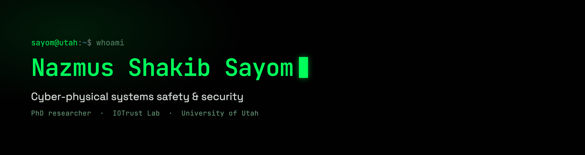

PhD researcher in **cyber-physical systems safety and security** at the University of Utah,
in the [IOTrust Lab](https://iotrustlab.com/people/nsssayom/) with [Luis A. Garcia](https://lagarcia.us/).
I work on system verification, safety falsification, and property-guided reduction and
surrogate execution for robotic and autonomous systems.

**Currently**

- Property-guided falsification and surrogation for CPS control stacks, validated on PX4 and ArduPilot
- Building [Obadh](https://github.com/nsssayom/obadh_engine), a deterministic Roman-to-Bangla transliteration engine and native keyboards (Rust core with autocorrect and autosuggest, iOS shipped)

**Find me**

[sayom.me](https://sayom.me) &nbsp;·&nbsp; [Google Scholar](https://scholar.google.com/citations?user=RLNbdK4AAAAJ) &nbsp;·&nbsp; [IOTrust Lab](https://iotrustlab.com/people/nsssayom/) &nbsp;·&nbsp; [LinkedIn](https://www.linkedin.com/in/nsssayom/)
