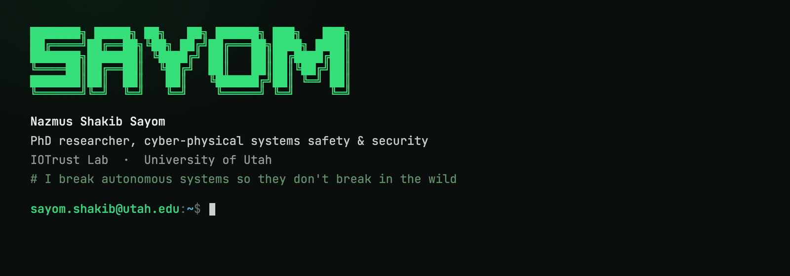

PhD researcher in **cyber-physical systems safety and security** at the University of Utah,
in the [IOTrust Lab](https://iotrustlab.com/people/nsssayom/) with [Luis A. Garcia](https://lagarcia.us/).
I work on system verification, safety falsification, and property-guided reduction and
surrogate execution for robotic and autonomous systems.

**Currently**

- Property-guided falsification and surrogation for CPS control stacks, validated on PX4 and ArduPilot
- Building [Obadh](https://github.com/nsssayom/obadh_engine), a deterministic Roman-to-Bangla transliteration engine and native keyboards (Rust core with autocorrect and autosuggest, iOS keyboard in development)

**Before the PhD**

I worked in embedded systems and Linux engineering: ARM Linux distributions built with Yocto (OTA updates, security hardening, kernel and driver work), multithreaded C/C++ and Python services, and IoT and computer-vision prototyping. Along the way I taught Operating Systems and Embedded Systems.

**Selected work**

- **[obadh_engine](https://github.com/nsssayom/obadh_engine)** `Rust` : a deterministic Roman-to-Bangla transliteration engine and modern successor to Avro Phonetic, with autocorrect and next-word autosuggest over its rule-based core.
- **[buggy_drone](https://github.com/iotrustlab/buggy_drone)** `Python` : a modular drone simulation with an STL-guided fuzzer and a structure-preserving reduced pipeline (SCRBE) for fast analysis of emergency-deployment logic.
- **[OpenGaze](https://github.com/nsssayom/OpenGaze)** `Python` : a web service for facial landmark, head-pose, and eye-gaze estimation built on OpenFace 2.0.
- **[TALK-E](https://github.com/nsssayom/TALK-E)** `C++` : an nRF24L01+ based digital walkie-talkie on 2.4 GHz radio, running on Arduino.

**Find me**

[sayom.me](https://sayom.me) &nbsp;·&nbsp; [Google Scholar](https://scholar.google.com/citations?user=RLNbdK4AAAAJ) &nbsp;·&nbsp; [IOTrust Lab](https://iotrustlab.com/people/nsssayom/) &nbsp;·&nbsp; [LinkedIn](https://www.linkedin.com/in/nsssayom/)
